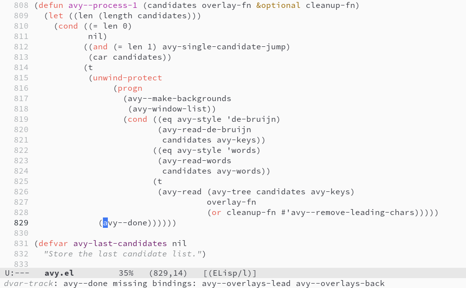
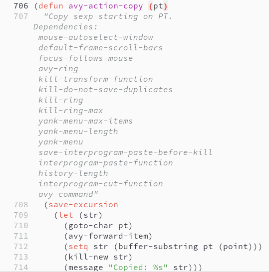
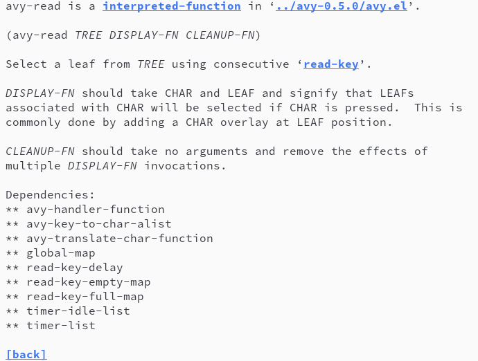

# dvar-track: A dynvar reference tracker
AUTHOR: Basil L. Contovounesios and Tsung-Han Liu

## File Organization

* `*.el`
  - `dvar-track.el`
    The core of _dvar-track_, provides dependency analysis, basic report, and inheritance traversal.
  - `dvar-eldoc.el`
    An _eldoc_ backend analyzes missing bindings on the fly. 
  - `dvar-docstring.el`
    Docstrings and _Help_ annotations.
* `dvar-tests/`
  Logging facilities in ELisp dump and aggregate C analysis result after running the testsuite of Emacs.
* `treesit/`
  - `global_parser.cpp` 
    The preprocessor for C analysis. It generates indirect access functions for every Lisp global variable defined in C, and patches rewriting every `&Vvarname` literal to `&globals.f_Vvarname`.
  - `applyupdate.sh`
    A script applying the referencing global variables patches.
  - `tree-sitter-c/`
    A submodule of C grammar for _tree-sitter_.
* `emacs-builder/Containerfile`
  An container includes dependencies for building Emacs.
* `emacs`
  a submodule contains the source code of Emacs-30.2.
* `emacs-patch/`
  C analysis facilities for Emacs-30.2.
  - `src/Makefile.in`
    A patched Makefile template includes _dvar-track_ related source code. 
  - `src/emacs.c`
    A patched initialization procedure registers the global variables for _dvar-track_.
  - `src/dvar-track.c` and `src/dvar-track.h`
    The core of C analysis.
  - `test/Makefile.in`
    A patched Makefile template enables C analysis, and dumps results with `dvar-tests/dump-result.el` for the testsuite.


## Installation

_dvar-track_ Lisp analysis depends on Emacs 30+ and [dash](https://github.com/magnars/dash.el).
Dash can be installed with the build-in package manager of Emacs.

    M-x package-install RET dash RET

Add the directory containing *dvar-track* source code to the load path of Emacs.

``` emacs-lisp
(add-to-list 'load-path "<PATH_TO_DVAR_TRACK>")
(require 'dvar-track)
```

> Testing _dvar-track_ does not requires C analysis.
> For the procedure to do C analysis, please check the [C analysis](#c-analysis) section.

## Usage

Set up variables with `dvar-track--clear-all-cache` before the first
time running analysis or when you don't want the previous result
included in the report.

    M-x dvar-track--clear-all-cache
    M-x dvar-track-report
    
`dvar-track-report` scans on Emacs Lisp file and generates a report
including the list of functions and their dependencies.

You might want to know how a variable became the dependency of a function. 

    M-x dvar-track--traverse-path RET <function-name> RET <variable-name>

`dvar-track--traverse-path` constructs a tree telling which function
accesses the target variable and how did the dependency inherited to
the target function.


### dvar-eldoc

*dvar-eldoc* is a on-the-fly missing binding checking [eldoc](https://www.gnu.org/software/emacs/manual/html_node/emacs/Programming-Language-Doc.html) backend.

``` emacs-lisp
(require 'dvar-eldoc)
```


To have the dependency information of the function the library you use, scan it beforehand.

    M-x dvar-track--scan-files-directory <path-to-ELPA or path-to-library>
    M-x dvar-track--toggle-eldoc

With the *dvar-eldoc*, in the echo buffer, you can see the list of dependencies that are not yet bound in the current lexical-scope when the cursor is on an explicit function call.



### dvar-docstring

``` emacs-lisp
(require 'dvar-docstring`)
```

In a Emacs Lisp source code buffer, enabling `dvar-docstring-mode` annotates the existing docstrings with the dependency list of the corresponding functions.
Enabling help annotation append dependencies information after the documentation in the help buffer.

    M-x dvar-docstring-mode
    M-x dvar-doc-toggle-help-annotation
    
Set `dvar-doc-automatically-parse` to non-nil, force _dvar-track_ to parse the function if it is not in cache when we use `describe-function`.
``` emacs-lisp
(setq dvar-doc-automatically-parse t)
```




# C Analysis

## Preparation

Clone submodules, use `--depth=1` to save time.

``` shell
git submodule update --depth=1 --init
```

Prepare for a Emacs compilation environment, we tested the patch with `emacs-builder/Containerfile`.

## Apply Patches

Install the patches

``` shell
cd emacs-patch
find . -type f -exec cp {} ../emacs/{} \;
cd ..
```

Configure Emacs and generate `globals.h` for the second phase patches.

``` shell
cd emacs
./autogen.sh
./configure --with-native-compilation=no
cd src
touch dvar-func.c # create a dummy file, so that make does not block the compilation
make globals.h
cd ../../
```

## Generate Indirect Access Functions & Compile Patched Emacs

Compile C grammar module and the global variable parser.

``` shell
cd treesit/tree-sitter-c
make
cd ..
make
cd ..
```

Generate indirect access functions and compile patched Emacs.

``` shell
cd emacs
../treesit/global_parser -t $(pwd)
cd src
../../treesit/applyupdate.sh # rewrite all &Vvarname literals
make # compile Emacs
```

## Test Variable Access Interception

Launch Emacs and open a scratch buffer.

``` emacs-lisp
(let ((dvar-log-variable-access t))
  (prin1 '(a b c)))
  
(gethash #'prin1 dvar-function-dependency)
```

Evaluate the code you can see something like:

```
#s(hash-table test equal data ("f_debug_on_next_call" t "f_symbols_with_pos_enabled" t "f_Vquit_flag" t "f_max_lisp_eval_depth" t "f_Vinternal_interpreter_environment" t "f_Vstandard_output" t "f_unibyte_display_via_language_environment" t "f_minibuffer_auto_raise" t "f_Vprint_continuous_numbering" t "f_Vprint_number_table" t "f_Vprint_circle" t "f_Vprint_level" t ...))
```

The strings are the C name of the intercepted dependencies of `prin1`.
